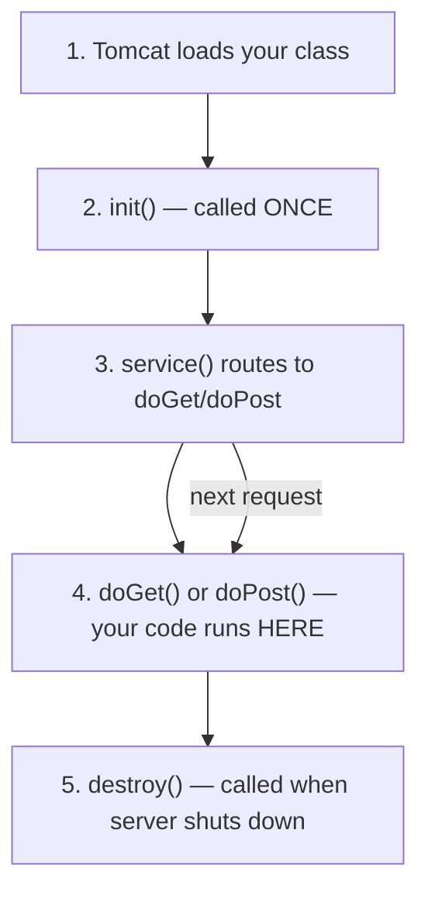

# 📚 Study & Learning Plan — 10-Day Sprint

---

## Learning Hours Estimate

| Technology | What You'll Use It For | Study Hours | Notes |
|-----------|----------------------|-------------|-------|
| **Java JDBC** | DAOs, PreparedStatement, ResultSet | 3–4 hrs | You know Java; JDBC is just the DB bridge |
| **Jakarta Servlets** | REST API endpoints | 5–6 hrs | Core of your project — guide below ⬇️ |
| **HTTP / REST** | API design, status codes, JSON | 2–3 hrs | Learned naturally while building servlets |
| **SvelteKit** | Frontend pages, routing, SSR | 6–8 hrs | New framework, but excellent tutorial exists |
| **Svelte (basics)** | Components, reactivity, binding | 2–3 hrs | Prerequisite for SvelteKit |
| **CSS (modern)** | Design system, glassmorphism | 2–3 hrs | Flexbox/Grid if not familiar |
| **OpenPDF** | Invoice PDF generation | 1–2 hrs | Small API, learn by example |
| **Git workflow** | Upstream sync, PRs, branches | 1–2 hrs | Learn as you go |
| **Bash scripting** | Dev server scripts | 0.5–1 hr | Optional, minimal |
| **Spring Boot** | Future migration (NOT now) | 8–12 hrs | Post-project study |
| **Total (project)** | | **~25–30 hrs** | Spread over 10 days |

> [!TIP]
> ~60% of learning happens while building. Don't study everything upfront. Study → Build → Revisit.

---

## 🧭 Abbreviation & Term Glossary

| Abbreviation | Full Name | What It Is |
|-------------|-----------|------------|
| **API** | Application Programming Interface | A set of URLs your frontend calls to get/send data |
| **REST** | Representational State Transfer | A style of API design using HTTP methods (GET, POST, PUT, DELETE) |
| **CRUD** | Create, Read, Update, Delete | The 4 basic database operations |
| **CORS** | Cross-Origin Resource Sharing | Browser security rule: blocks requests between different domains/ports unless server explicitly allows it |
| **CSRF** | Cross-Site Request Forgery | Attack where a malicious site tricks your browser into making requests to your app |
| **JDBC** | Java Database Connectivity | Java's standard API for talking to databases |
| **DAO** | Data Access Object | A class whose only job is database queries for one entity (e.g., `CustomerDAO`) |
| **POJO** | Plain Old Java Object | A simple Java class with fields + getters/setters, no framework dependencies |
| **WAR** | Web Application Archive | A packaged Java web app (ZIP of your compiled servlets + web.xml). Deployed to Tomcat. |
| **JAR** | Java Archive | A packaged Java app. Spring Boot uses JARs with embedded Tomcat. |
| **JSON** | JavaScript Object Notation | Text format for data: `{"name": "Ahmed"}`. The language of REST APIs. |
| **HTTP** | HyperText Transfer Protocol | The protocol browsers use to talk to servers (GET, POST, etc.) |
| **HTTPS** | HTTP Secure | HTTP encrypted with SSL/TLS. Neon requires this. |
| **SSL/TLS** | Secure Sockets Layer / Transport Layer Security | Encryption between client and server |
| **SSR** | Server-Side Rendering | SvelteKit renders pages on the server before sending HTML to browser (faster first load) |
| **SPA** | Single Page Application | Frontend loads once, then handles navigation in JavaScript (no page reloads) |
| **CDR** | Call Detail Record | A log entry for one phone call/SMS/data session — the core data your system processes |
| **MSISDN** | Mobile Station International Subscriber Directory Number | Fancy name for a phone number (e.g., `00201221234567`) |
| **BSCS** | Business Support Control System | Telecom billing platform by Ericsson — the industry standard your project simulates |
| **ORM** | Object-Relational Mapping | Auto-converts DB rows ↔ Java objects (JPA/Hibernate). You're doing this manually with DAOs. |
| **JPA** | Java Persistence API | Standard ORM API in Java. Spring Boot uses this instead of raw JDBC. |
| **JWT** | JSON Web Token | Encoded token for stateless auth. You're using sessions instead (simpler). |
| **bcrypt** | — (it's a name, not acronym) | Password hashing algorithm. Slow on purpose so brute-force attacks take years. |
| **UUID** | Universally Unique Identifier | Random string like `550e8400-e29b-41d4-a716-446655440000`. Used for session IDs. |
| **FK** | Foreign Key | Database constraint linking one table's column to another table's primary key |
| **PK** | Primary Key | Unique identifier for each row in a table (usually `id SERIAL`) |
| **MVC** | Model-View-Controller | Architecture pattern: Model (data), View (UI), Controller (logic). See deep-dive below ⬇️ |
| **POM** | Project Object Model | Maven's config file (`pom.xml`). Lists dependencies, Java version, build settings. See practice guide. |
| **Maven** | — (name, not acronym) | Build tool that downloads dependencies, compiles code, and packages your app into a WAR/JAR. |
| **WAR** is above | — | — |
| **XML** | eXtensible Markup Language | Tag-based format for config files. `pom.xml` and `web.xml` use it. Being replaced by annotations in modern Java. |
| **JRXML** | Jasper Report XML | JasperReports template file. Defines PDF layout in XML. Compiled to `.jasper` binary. |
| **JasperReports** | — (name) | Enterprise PDF/report generation engine. Industry standard in telecom/banking. |

---

## 🏗️ MVC Architecture — How Your Project Is Organized

### What Does MVC Stand For?

**M**odel — **V**iew — **C**ontroller

| Letter | Full Name | What It Is | Your Project |
|--------|-----------|-----------|-------------|
| **M** | Model | The **data** — Java classes that represent database tables | `Customer.java`, `RatePlan.java`, `AppUser.java` |
| **V** | View | The **UI** — what the user sees and interacts with | SvelteKit pages (`.svelte` files) |
| **C** | Controller | The **brain** — receives user actions, processes them, returns results | Servlets (`CustomerServlet.java`) |

### Why Separate Them?

Without MVC, you'd put everything in one file — database queries, business logic, and HTML generation mixed together. It works, but it's a nightmare to maintain:

```java
// ❌ BAD — everything in one servlet
protected void doGet(req, res) {
    Connection conn = DriverManager.getConnection(...);  // DB code
    ResultSet rs = conn.prepareStatement("SELECT * FROM customer").executeQuery();
    String html = "<html><body>";
    while (rs.next()) {
        html += "<p>" + rs.getString("name") + "</p>";  // UI code
    }
    res.getWriter().print(html);  // Response code
}
```

With MVC, each layer has **one job**:
```
// ✅ GOOD — each layer does one thing
Servlet (Controller)  → decides what to do
DAO (Model helper)    → talks to database
Model (Model)         → holds the data
SvelteKit (View)      → displays it beautifully
```

### How Data Flows in Your Project

**Example: User visits `/customers` page**

```
Step 1: BROWSER                    Step 2: SVELTEKIT (View)
User clicks "Customers"    →      +page.server.ts calls
                                  fetch('http://localhost:8080/api/admin/customers')
                                            │
                                            ▼
Step 3: SERVLET (Controller)       Step 4: DAO (Model helper)
CustomerServlet.doGet()     →     CustomerDAO.findAll()
  - checks auth                    - opens DB connection
  - calls DAO                      - runs SQL: SELECT * FROM customer
  - returns JSON                   - maps rows → Customer objects
                                            │
                                            ▼
Step 5: DATABASE                   Step 6: BACK UP THE CHAIN
PostgreSQL returns rows     →     DAO returns List<Customer>
                                  → Servlet converts to JSON
                                  → SvelteKit receives JSON
                                  → Svelte renders the table
                                  → User sees customers
```

### Where Does the DAO Fit?

**DAO** = **D**ata **A**ccess **O**bject. It's an extra layer between the Controller and the Database.

```
Classic MVC:     Controller → Model → Database
Your Project:    Controller → DAO → Database (DAO returns Model objects)
```

**Why the extra layer?** Because the Controller shouldn't know SQL. If you ever switch from PostgreSQL to MySQL, or from JDBC to JPA, you only change the DAO — the servlet stays the same.

```java
// CustomerServlet (Controller) — doesn't know about SQL
protected void doGet(req, res) {
    List<Customer> customers = customerDAO.findAll();  // just calls DAO
    sendJson(res, customers);
}

// CustomerDAO (DAO) — ONLY this class knows SQL
public List<Customer> findAll() {
    String sql = "SELECT * FROM customer";  // SQL lives HERE, nowhere else
    try (Connection conn = DB.getConnection();
         PreparedStatement ps = conn.prepareStatement(sql);
         ResultSet rs = ps.executeQuery()) {
        List<Customer> list = new ArrayList<>();
        while (rs.next()) {
            Customer c = new Customer();    // Model object
            c.setId(rs.getInt("id"));
            c.setName(rs.getString("name"));
            list.add(c);
        }
        return list;
    }
}

// Customer (Model) — just data, no logic
public class Customer {
    private int id;
    private String name;
    private String address;
    // + getters and setters
}
```

### Your Project's Layer Map

```
┌─────────────────────────────────────────────┐
│  VIEW (SvelteKit)                           │
│  +page.svelte → what user sees              │
│  +page.server.ts → fetches from API         │
├─────────────────────────────────────────────┤
│  CONTROLLER (Servlets)                      │
│  CustomerServlet → /api/admin/customers     │
│  AuthServlet → /api/auth/login              │
│  PublicServlet → /api/public/rateplans      │
├─────────────────────────────────────────────┤
│  MODEL (POJOs + DAOs)                       │
│  Customer.java → data shape                 │
│  CustomerDAO.java → SQL queries             │
├─────────────────────────────────────────────┤
│  DATABASE (PostgreSQL on Neon)              │
│  customer, rateplan, contract, bill tables  │
└─────────────────────────────────────────────┘
```

### Why This Matters for Your Career

Every web framework uses MVC (or a variant):

| Framework | Controller | Model | View |
|-----------|-----------|-------|------|
| **Your Project** | Servlet | POJO + DAO | SvelteKit |
| **Spring Boot** | @RestController | @Entity + JpaRepository | Any frontend |
| **Django (Python)** | views.py | models.py | templates/ |
| **Laravel (PHP)** | Controller.php | Model.php | Blade templates |
| **Express (Node)** | routes/ | models/ | React/Vue/EJS |
| **ASP.NET (C#)** | Controller.cs | Model.cs | Razor pages |

Learn MVC once → understand every framework.

---

## 🔐 Role-Based Auth & Multi-Zone Architecture

### What is Role-Based Access?

Different users see different things based on their **role**. Instead of building separate apps for admins and customers, one app checks `user.role` and decides what to show/allow.

```
Same login page → Check role → Different experience

Admin    → Full control (manage all customers, billing, invoices)
Customer → Self-service (view own profile, own invoices, browse packages)
Public   → No login (browse packages, register)
```

### How It Works in Your Project

**Database**: One `app_user` table with a `role` column:
```sql
INSERT INTO app_user (username, password_hash, full_name, role)
VALUES ('admin', '...', 'Admin', 'admin');       -- admin user

INSERT INTO app_user (username, password_hash, full_name, role)
VALUES ('ahmed', '...', 'Ahmed Ali', 'customer'); -- customer user
```

**AuthFilter**: Checks role per URL zone:
```java
if (path.startsWith("/api/public")) {
    // No auth — anyone can browse packages
    chain.doFilter(req, res);
} else if (path.startsWith("/api/admin")) {
    // Only admin role
    if (user != null && "admin".equals(user.getRole())) {
        chain.doFilter(req, res);
    } else {
        res.sendError(403);  // 403 = Forbidden (logged in but wrong role)
    }
} else if (path.startsWith("/api/customer")) {
    // Customer OR admin (admins can do everything)
    if (user != null) {
        chain.doFilter(req, res);
    } else {
        res.sendError(401);  // 401 = Not authenticated
    }
}
```

**Key distinction**:
- `401 Unauthorized` = "You're not logged in. Go login first."
- `403 Forbidden` = "You're logged in, but you don't have permission for this."

### Customer ↔ User Linking

```
app_user (credentials)          customer (profile)
┌──────────────┐                ┌──────────────────┐
│ id: 5        │                │ id: 12           │
│ username     │    FK link     │ name: Ahmed Ali  │
│ password_hash│◄───────────────│ user_id: 5       │
│ role: customer│               │ address: Cairo   │
└──────────────┘                └──────────────────┘
```

- Admin creates customer via panel → `customer` record only (no login, `user_id = NULL`)
- Customer registers themselves → creates BOTH records, links them
- Customer logs in → system looks up `customer WHERE user_id = app_user.id` → gets their profile

---

## 🔥 Java Servlets — Learn While You Build

### What is a Servlet?

A servlet is a **Java class that handles HTTP requests**. Think of it as a function that receives a request (URL, headers, body) and returns a response (HTML, JSON, file).

```
Browser → HTTP Request → Tomcat → Your Servlet → HTTP Response → Browser
```

Tomcat is the "server" that listens on port 8080 and routes requests to your servlets based on URL patterns.

---

### The Servlet Lifecycle (5 steps)



**Key insight**: Tomcat creates **ONE instance** of your servlet and reuses it for all requests. That's why shared state (static variables) is dangerous — multiple threads hit the same instance.

---

### Anatomy of a Servlet (What You'll Write)

```java
package com.billing.servlet;

import jakarta.servlet.annotation.WebServlet;
import jakarta.servlet.http.*;
import java.io.*;

// 1. @WebServlet — tells Tomcat "handle requests to /api/customers/*"
@WebServlet("/api/customers/*")
public class CustomerServlet extends HttpServlet {

    // 2. doGet — handles GET requests (fetch data)
    @Override
    protected void doGet(HttpServletRequest req, HttpServletResponse res)
            throws IOException {
        
        // READ from request
        String query = req.getParameter("q");        // ?q=Ahmed
        String pathInfo = req.getPathInfo();          // /123 from /api/customers/123
        HttpSession session = req.getSession(false);  // get login session
        
        // WRITE to response
        res.setContentType("application/json");
        res.setCharacterEncoding("UTF-8");
        res.setStatus(200);  // 200 = OK
        
        PrintWriter out = res.getWriter();
        out.print("{\"name\": \"Ahmed\"}");
    }

    // 3. doPost — handles POST requests (create data)
    @Override
    protected void doPost(HttpServletRequest req, HttpServletResponse res)
            throws IOException {
        
        // Read JSON body
        BufferedReader reader = req.getReader();
        StringBuilder body = new StringBuilder();
        String line;
        while ((line = reader.readLine()) != null) {
            body.append(line);
        }
        // body.toString() = {"name": "Ahmed", "address": "Cairo"}
        
        res.setStatus(201);  // 201 = Created
        res.getWriter().print("{\"id\": 1}");
    }

    // 4. doPut — handles PUT requests (update data)
    // 5. doDelete — handles DELETE requests
}
```

---

### Key Concepts Mapped to Your Code

#### 1. `@WebServlet` — URL Mapping
```java
@WebServlet("/api/customers/*")  // handles /api/customers and /api/customers/123
```
The `/*` wildcard means this servlet handles all sub-paths. You extract the ID from `req.getPathInfo()`.

**Why not `web.xml`?** Annotations (`@WebServlet`) replaced XML config in Servlet 3.0+. Cleaner, less boilerplate. Your project's `web.xml` is mostly empty because annotations handle everything.

#### 2. `HttpServletRequest` — Everything About the Request
```java
req.getMethod()           // "GET", "POST", "PUT"
req.getParameter("q")    // query string: ?q=value
req.getPathInfo()         // path after servlet mapping: /123
req.getHeader("Cookie")   // HTTP headers
req.getReader()           // request body (for POST/PUT)
req.getSession()          // HttpSession (login state)
req.getAttribute("user")  // data set by filters (auth check)
```

#### 3. `HttpServletResponse` — What You Send Back
```java
res.setStatus(200)                        // HTTP status code
res.setContentType("application/json")    // tell browser it's JSON
res.getWriter().print("{...}")            // write response body
res.sendError(404, "Not found")           // error shortcut
```

#### 4. HTTP Status Codes You'll Use
```
200 OK           — successful GET
201 Created      — successful POST (new resource)
400 Bad Request  — invalid input from client
401 Unauthorized — not logged in
404 Not Found    — resource doesn't exist
500 Server Error — your code threw an exception
```

#### 5. Filters — Middleware (Auth, CORS)

**What is middleware?** Code that runs between the request arriving and your servlet handling it. Like a security checkpoint before entering a building.

**What is a Filter?** Jakarta's name for middleware. A Java class that intercepts requests, does something (check login, add headers), then either passes the request forward or blocks it.

**Real-world analogy:**
```
You (Request) → Reception Desk (CorsFilter) → Security Guard (AuthFilter) → Office (Servlet)
                "Do you have permission     "Show your badge"            "Here's your data"
                 to be in this building?"    ✅ Pass / ❌ Block
```

**Why two filters?**
- **CorsFilter** solves a browser restriction: when SvelteKit (:5173) calls Tomcat (:8080), the browser blocks it unless Tomcat says "I allow requests from :5173." CORS headers are that permission.
- **AuthFilter** checks login: is there a valid session? If not, return 401 (Unauthorized) and stop.

**The chain pattern:**
```
Request → CorsFilter → AuthFilter → CustomerServlet → Response
              ↓              ↓              ↓
         Add headers    Check login    Handle request
         chain.doFilter() chain.doFilter()   (end of chain)
```

If any filter does NOT call `chain.doFilter()`, the request **stops there**. The servlet never runs. That's how AuthFilter blocks unauthenticated requests.

```java
@WebFilter("/api/*")
public class AuthFilter implements Filter {
    @Override
    public void doFilter(ServletRequest req, ServletResponse res, 
                         FilterChain chain) throws IOException, ServletException {
        HttpServletRequest httpReq = (HttpServletRequest) req;
        HttpSession session = httpReq.getSession(false);
        
        if (session != null && session.getAttribute("user") != null) {
            chain.doFilter(req, res);  // ✅ authenticated — pass to next filter/servlet
        } else {
            ((HttpServletResponse) res).sendError(401);  // ❌ blocked — NO chain.doFilter()
        }
    }
}
```

**Key takeaways:**
- `chain.doFilter(req, res)` = "I'm done, pass it forward"
- No `chain.doFilter()` = "Request stops here, I'm blocking it"
- Filter order matters: CORS must run first, then Auth, then your servlet

#### 6. HttpSession — Login State
```java
// LOGIN — store user in session
HttpSession session = req.getSession(true);  // true = create if absent
session.setAttribute("user", userObject);

// CHECK — in filter or servlet
HttpSession session = req.getSession(false); // false = don't create
Object user = session.getAttribute("user");  // null if not logged in

// LOGOUT
session.invalidate();  // destroy session
```

Tomcat handles the cookie (`JSESSIONID`) automatically. You never touch cookies directly for sessions.

---

### How Request Routing Works

```
GET /api/customers?q=Ahmed     →  CustomerServlet.doGet()
POST /api/customers            →  CustomerServlet.doPost()
GET /api/customers/5           →  CustomerServlet.doGet()  (pathInfo = "/5")
GET /api/customers/5/invoices  →  CustomerServlet.doGet()  (pathInfo = "/5/invoices")
PUT /api/customers/5           →  CustomerServlet.doPut()  (pathInfo = "/5")
```

Extracting the ID:
```java
String pathInfo = req.getPathInfo();  // "/5" or "/5/invoices" or null
if (pathInfo != null) {
    String[] parts = pathInfo.split("/");  // ["", "5"] or ["", "5", "invoices"]
    int id = Integer.parseInt(parts[1]);
}
```

---

### Your BaseServlet — Reusable Helpers

Instead of repeating JSON serialization in every servlet:

```java
public abstract class BaseServlet extends HttpServlet {
    protected Gson gson = new Gson();
    
    // Send any object as JSON
    protected void sendJson(HttpServletResponse res, Object data) throws IOException {
        res.setContentType("application/json");
        res.setCharacterEncoding("UTF-8");
        res.getWriter().print(gson.toJson(data));
    }
    
    // Read JSON body into a Java object
    protected <T> T readJson(HttpServletRequest req, Class<T> clazz) throws IOException {
        return gson.fromJson(req.getReader(), clazz);
    }
    
    // Send error with JSON body
    protected void sendError(HttpServletResponse res, int status, String msg) throws IOException {
        res.setStatus(status);
        sendJson(res, Map.of("error", msg));
    }
}
```

Then your servlets just extend it:
```java
@WebServlet("/api/customers/*")
public class CustomerServlet extends BaseServlet {
    @Override
    protected void doGet(HttpServletRequest req, HttpServletResponse res) throws IOException {
        List<Customer> customers = customerDAO.findAll();
        sendJson(res, customers);  // one line!
    }
}
```

---

### Servlet vs Spring Boot — Side by Side

| Concept | Servlet (Your Project) | Spring Boot (Future) |
|---------|----------------------|---------------------|
| **Entry point** | `class extends HttpServlet` | `class with @RestController` |
| **URL mapping** | `@WebServlet("/api/x")` | `@RequestMapping("/api/x")` |
| **GET handler** | `doGet(req, res)` | `@GetMapping` method |
| **Read param** | `req.getParameter("q")` | `@RequestParam String q` |
| **Read path** | `req.getPathInfo()` | `@PathVariable int id` |
| **Read body** | `gson.fromJson(req.getReader())` | `@RequestBody Customer c` |
| **Return JSON** | `res.getWriter().print(json)` | `return object` (auto-serialized) |
| **Filter** | `@WebFilter` + `Filter` interface | `@Component` + `OncePerRequestFilter` |
| **Session** | `req.getSession()` | Spring Security handles it |
| **DB access** | Manual JDBC in DAO | `JpaRepository` interface |
| **Config** | `web.xml` / annotations | `application.properties` |
| **Server** | External Tomcat (WAR) | Embedded Tomcat (JAR) |

> [!IMPORTANT]
> Spring Boot is just servlets with **layers of convenience on top**. Understanding servlets = understanding what Spring does under the hood.

---

## 🟠 SvelteKit — Learn While You Build

### Three Concepts You Need

#### 1. Routing (File-Based)

**Without SvelteKit** (manual):
```javascript
// You'd write this yourself:
if (window.location.pathname === "/customers") showCustomerPage();
if (window.location.pathname === "/billing") showBillingPage();
// ...for every single page. Tedious and error-prone.
```

**With SvelteKit** (automatic):
Just create files in `src/routes/`. The folder structure IS the URL structure.

```
src/routes/
├── +page.svelte              →  localhost:5173/           (Dashboard)
├── login/
│   └── +page.svelte          →  localhost:5173/login      (Login page)
├── customers/
│   ├── +page.svelte          →  localhost:5173/customers  (Customer list)
│   ├── new/
│   │   └── +page.svelte      →  localhost:5173/customers/new
│   └── [id]/
│       └── +page.svelte      →  localhost:5173/customers/5  (any number works)
```

The `[id]` folder with brackets = **dynamic route**. SvelteKit extracts the value:
```javascript
// In src/routes/customers/[id]/+page.svelte
// URL: /customers/42
// SvelteKit gives you: params.id = "42"
```

**Think of it like**: each `+page.svelte` file is a page. The folder path is its URL. No configuration needed.

---

#### 2. Server-Side Data Loading

**Without server-side loading** (bad):
```
1. Browser requests page     → Server sends empty HTML
2. Browser shows blank page  → JavaScript starts running
3. JavaScript calls API      → Loading spinner appears
4. API responds              → Data finally shows up
                                (user stared at blank/spinner for 1-2 seconds)
```

**With SvelteKit's server-side loading** (good):
```
1. Browser requests page     → SvelteKit server calls YOUR Java API
2. SvelteKit gets data back  → Builds complete HTML with data already in it
3. Browser receives page     → Data is ALREADY there. No spinner. Instant.
```

**How it works**: Two files per page:

```
customers/
├── +page.svelte          ← The UI (what user sees)
└── +page.server.ts       ← Runs on SERVER before page renders
```

```typescript
// +page.server.ts — this runs on the SvelteKit SERVER, not in the browser
// It calls your Java API and passes data to the page

export async function load({ fetch }) {
    // This fetch() runs on the server — no CORS issues!
    // It calls your Java servlet at localhost:8080
    const response = await fetch('http://localhost:8080/api/customers');
    const customers = await response.json();
    
    // Whatever you return here is available in +page.svelte as "data"
    return { customers };
}
```

```svelte
<!-- +page.svelte — the UI component -->
<script>
    // "data" comes from +page.server.ts's load() function
    // It's already loaded BEFORE this page renders — no loading state needed
    export let data;
</script>

<h1>Customers</h1>
{#each data.customers as customer}
    <p>{customer.name} — {customer.address}</p>
{/each}
```

**Analogy**: `+page.server.ts` is like a waiter who goes to the kitchen (Java API), gets your food (data), and brings it to your table (page) — all before you even sit down.

---

#### 3. Dev Server

When you run `npm run dev`, SvelteKit starts a local server at `localhost:5173` that:
- **Serves your pages** — open browser, navigate around
- **Hot reloads** — you edit a `.svelte` file, save it, browser updates instantly (no manual refresh)
- **Shows errors** — syntax errors appear directly in the browser with the exact line number
- **Runs server-side code** — `+page.server.ts` files execute here

```bash
cd frontend
npm run dev

#   VITE v5.x  ready in 300ms
#   ➜  Local:   http://localhost:5173/    ← open this in browser
#   ➜  Network: http://192.168.1.x:5173/
```

You'll have **two servers running** during development:
```
localhost:5173  →  SvelteKit (your frontend pages)
localhost:8080  →  Tomcat (your Java API servlets)
```

SvelteKit's server-side code (`+page.server.ts`) calls Tomcat's API internally. The browser only talks to SvelteKit.

---

### Svelte Basics (The UI Part)

Svelte is what you write inside `+page.svelte` files. Quick overview:

```svelte
<!-- 1. SCRIPT — JavaScript logic -->
<script>
    let name = "Ahmed";        // reactive variable — UI updates when this changes
    let count = 0;
    
    function increment() {
        count += 1;            // just change the variable — Svelte updates the DOM
    }
</script>

<!-- 2. HTML — with Svelte syntax -->
<h1>Hello {name}!</h1>        <!-- {curly braces} = insert JavaScript value -->
<p>Count: {count}</p>
<button on:click={increment}>Click me</button>  <!-- on:event = event handler -->

<!-- 3. Conditional rendering -->
{#if count > 5}
    <p>Count is big!</p>
{:else}
    <p>Keep clicking</p>
{/if}

<!-- 4. Loops -->
{#each customers as customer}
    <div>{customer.name}</div>
{/each}

<!-- 5. STYLE — scoped CSS (only affects THIS component) -->
<style>
    h1 { color: #E00800; }    /* e& Red — only this component's h1 */
</style>
```

**Key differences from React:**
- No `useState()` — just `let x = 0;` (any variable is reactive)
- No `JSX` — write real HTML with `{expressions}`
- No virtual DOM — Svelte compiles to direct DOM updates (faster)
- CSS is scoped by default — no class name collisions

---

## 10-Day Timeline

### Days 1–2: Foundation (Phase 0 + 1)
**Build**: Git setup, DB layer, models, DAOs
**Study**: SQL JOINs, JDBC PreparedStatement, try-with-resources
- [SQLBolt](https://sqlbolt.com/) — interactive (1 hr)
- [Baeldung JDBC](https://www.baeldung.com/java-jdbc) — read while coding (1 hr)

### Days 3–4: Auth + Core API (Phase 2 + 3)
**Build**: Auth, Customer/RatePlan/Contract servlets
**Study**: Servlet guide above ⬆️, test with `curl`
- [Baeldung Servlet Guide](https://www.baeldung.com/intro-to-servlets) (1 hr)

### Days 5–6: Billing + PDF + SvelteKit Setup (Phase 4 + 5 start)
**Build**: Bill/Invoice servlets, PDF, SvelteKit scaffold
**Study**: OpenPDF examples, Svelte basics
- [Svelte Tutorial](https://svelte.dev/tutorial) — do FIRST (2 hrs)
- [SvelteKit Tutorial](https://learn.svelte.dev/) (2 hrs)

### Days 7–8: Frontend Pages (Phase 5 continued)
**Build**: Login, Dashboard, Customer/Profile pages
**Study**: CSS Grid/Flexbox as needed
- [CSS Grid Garden](https://cssgridgarden.com/) (30 min)

### Days 9–10: Polish + Integration
**Build**: Remaining pages, bug fixes, testing
**Study**: Git PRs, bash scripts

---

## Spring Boot Study Resources (Post-Project)

| Resource | Type | Time | What You'll Learn |
|----------|------|------|-------------------|
| [Spring Boot in 100s (Fireship)](https://www.youtube.com/watch?v=9SGDpanrc8U) | Video | 2 min | High-level overview |
| [Spring Initializr](https://start.spring.io/) | Tool | 5 min | Project generator — try it |
| [Baeldung Spring Boot REST](https://www.baeldung.com/spring-boot-start) | Article | 2 hrs | Build a REST API |
| [Spring Boot Official Guide](https://spring.io/guides/gs/rest-service/) | Tutorial | 1 hr | Official getting started |
| [Amigoscode Spring Boot Full Course](https://www.youtube.com/watch?v=9SGDpanrc8U) | Video | 3 hrs | Comprehensive walkthrough |

### Migration Steps (When Ready)

| # | What Changes | From → To | Time |
|---|-------------|-----------|------|
| 1 | Build config | WAR `pom.xml` → `spring-boot-starter-web` JAR | 30 min |
| 2 | DB config | `DB.java` → `application.properties` auto-config | 30 min |
| 3 | DAOs | Manual JDBC → `JpaRepository` interface | 1 hr/DAO |
| 4 | Servlets | `HttpServlet` → `@RestController` | 1 hr/servlet |
| 5 | Auth | Manual filter → Spring Security | 2 hrs |
| 6 | Server | External Tomcat → Embedded (just `java -jar app.jar`) | 5 min |

### What Stays the Same
- ✅ SvelteKit frontend (change API base URL only)
- ✅ Database schema
- ✅ PDF generation logic
- ✅ Business logic in DAOs (refactored into Services)

> [!TIP]
> Servlet knowledge transfers directly to Spring. Every `@RestController` sits on top of the Servlet API. Learning servlets first = deeper understanding than most Spring developers have.

---

## 📄 JasperReports — Enterprise PDF Generation

### What Is JasperReports?

JasperReports is the **industry standard** for generating PDF reports in Java. Used by telecom companies (Vodafone, Ericsson), banks, and enterprise software worldwide.

### How It Works (4 Steps)

```
Step 1: DESIGN → You create a .jrxml file (XML template)
        Defines: layout, fonts, colors, table structure
        Think of it as: "HTML for PDFs"

Step 2: COMPILE → Java compiles .jrxml → .jasper (binary)
        JasperCompileManager.compileReport(inputStream)
        Do this ONCE, cache the result (avoids 2-5s delay)

Step 3: FILL → Java fills template with real data → JasperPrint
        JasperFillManager.fillReport(report, params, dataSource)
        params = single values (customer name, date)
        dataSource = repeating rows (service charges table)

Step 4: EXPORT → Convert JasperPrint → PDF bytes
        JasperExportManager.exportReportToPdf(jasperPrint)
        Can also export to: HTML, Excel, CSV, Word
```

### Key Concepts

| Concept | What It Is | Our Project |
|---------|-----------|-------------|
| **Parameter** | Single value passed from Java | Customer name, invoice date, total |
| **Field** | Column from data source (repeats per row) | Service name, description, amount |
| **Band** | Horizontal section of the report | Title, column header, detail, summary |
| **DataSource** | Collection of rows to iterate | List of charge line items |

### Template Structure (.jrxml)

```xml
<jasperReport>
  <!-- Parameters: single values -->
  <parameter name="customerName" class="java.lang.String"/>

  <!-- Fields: columns from data source -->
  <field name="service" class="java.lang.String"/>

  <!-- Title band: appears once at top -->
  <title><band height="100">...</band></title>

  <!-- Column header: table header row -->
  <columnHeader><band height="25">...</band></columnHeader>

  <!-- Detail band: REPEATS for each data row -->
  <detail><band height="20">...</band></detail>

  <!-- Summary band: totals at bottom -->
  <summary><band height="60">...</band></summary>
</jasperReport>
```

### Why Enterprises Use Jasper (Not OpenPDF/Flying Saucer)

1. **Non-developers can edit templates** — business analysts use JasperSoft Studio (visual editor)
2. **Multi-format output** — same template → PDF, Excel, HTML, CSV
3. **Subreports** — embed reports inside reports (invoice + detailed usage breakdown)
4. **Charts & graphs** — built-in bar charts, pie charts, line graphs
5. **Batch processing** — generate millions of invoices in scheduled jobs
6. **Compliance** — pixel-perfect, auditable output required by regulators

> [!TIP]
> After this project, download **JasperSoft Studio** (free, Eclipse-based IDE) to design templates visually instead of writing XML by hand. That's how enterprise teams work.
